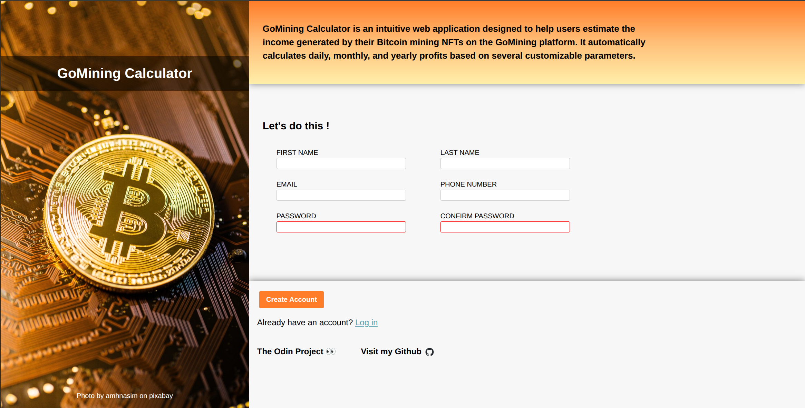

# GoMining Calculator

## Description

GoMining Calculator is an intuitive web application designed to help users estimate the income generated by their Bitcoin mining NFTs on the GoMining platform. The application automatically calculates daily, monthly, and yearly profits based on several customizable parameters.

## Image



## Features

- Modern and responsive user interface
- Complete registration form
- Elegant design with Bitcoin background image
- Interactive animations
- Social media integration (GitHub)

## Technologies Used

- HTML5
- CSS3
- JavaScript
- Custom font (Norse Bold)

## Installation

1. Clone the repository:

```bash
git clone https://github.com/ReMoOuZz/Form-Project.git
```

2. Open the `index.html` file in your preferred web browser

## Project Structure

```
Form-Project/
├── images/
│   ├── btc_wallpaper.jpg
│   ├── github-mark.png
│   └── odin-lined.png
├── fonts/
│   └── Norse-Bold.otf
├── index.html
├── style.css
├── main.js
└── README.md
```

## Contact

GitHub: [ReMoOuZz](https://github.com/ReMoOuZz)

## Acknowledgments

- Background photo by amhnasim on pixabay
- The Odin Project for inspiration
